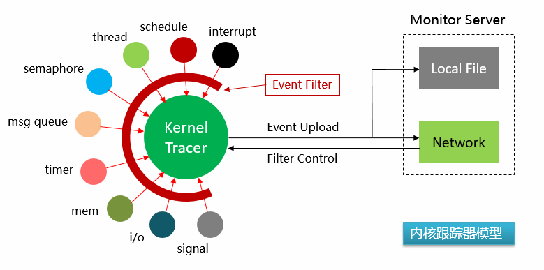
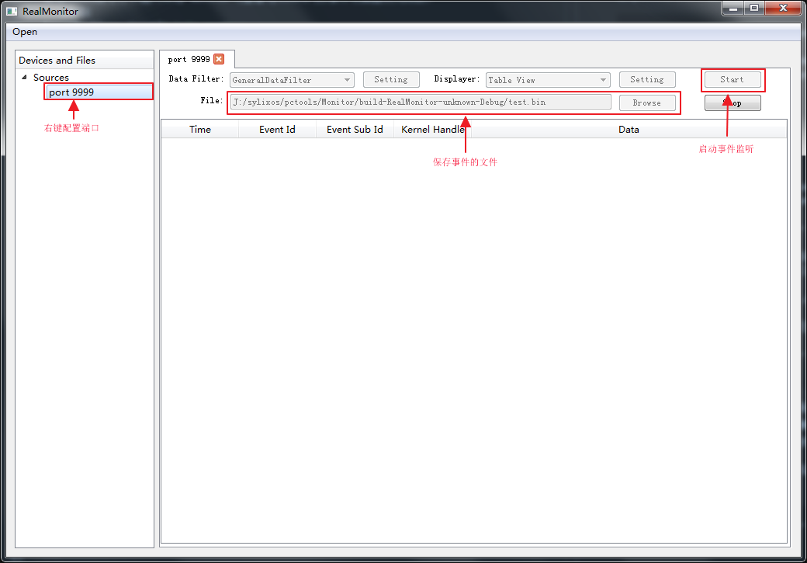
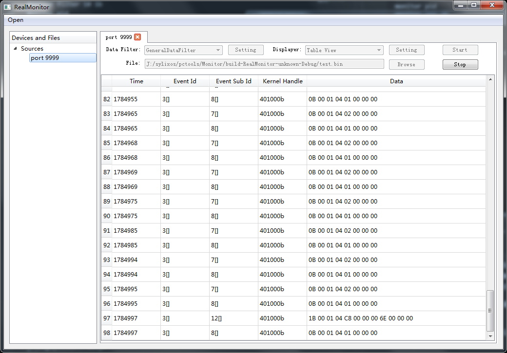

# SylixOS内核事件监控器指导

本文主要介绍SylixOS内核事件监控器概况，以及如何在其基础上做改进和优化工作，本文的内容包括：
1. SylixOS内核事件监控器框架
2. SylixOS内核事件监控器命令说明
3. SylixOS内核事件监控器源代码结构
4. 事件数据格式以及通信协议说明
5. SylixOS内核事件监控器改进和扩展思路

## SylixOS内核事件监控器框架
SylixOS内核事件收集器在系统内开辟一个环形缓冲去用于保存事件信息，当系统发生内核事件时，将事件记录到缓冲区。SylixOS内核事件收集器开启一个事件发送线程，可定期将收集的内核事件通过网络发送到事件服务器或记录成文件。



当前SylixOS内核事件收集器实现了一些基本内核事件的收集，包括但不限于：
1. 中断信息（包括中断产生时间、中断号）
2. 任务（线程）信息（任务进入和退出时间）
3. 内存分配、释放等
4. 系统异常
5. I/O事件（open\close\read\write\ioctl）
6. 网络事件(网络接口统计信息)
7. 信号量的申请与释放
8. 消息队列发送与接收
9. 事件/事件集信息（创建、删除等）
10. 任务（线程）的创建与删除
11. 定时器事件（创建、删除、超时等）
12. 信号系统的产生的信号及信号响应处理

## SylixOS内核事件监控器命令说明

在SylixOS命令行中输入help monitor可查看SylixOS内核事件收集器使用帮助.  
```shell
[root@sylixos:/root]# help monitor
kernel moniter setting.
monitor start 192.168.1.1:1234
monitor start /mnt/nfs/monitor.data
monitor stop
monitor filter
monitor filter 10 1b
monitor pid
monitor pid 20
            <  0 : all.
            == 0 : kernel.
            >  0 : whose process ID is equal to the value of pid.
monitor {[start {file | ip:port}] | [stop] | [filter [event allow-mask]] | [pid [pid]]}
```
在启动事件监控器之前，需在pc端启动事件服务器，服务器需要自己实现。为方便协议调试，本文提供一个简单的demo程序，该demo以列表方式展现事件监控器上报的事件信息。事件服务器demo界面如下：  



启动事件监控器，命令如下：
```shell
[root@sylixos:/root]# monitor start 192.168.7.22:9999
monitor start.
```
事件监控器启动后，默认过滤掉所有事件，可以通过shell命令设置记录指定的事件，以下命令开打所有线程调度相关事件记录。
```shell
[root@sylixos:/root]# monitor filter 3 ffffffffffffffff
[root@sylixos:/root]#
```
3为事件类型ID，ffffffffffffffff为事件掩码，每个事件类型最多可包含64个子事件，每个子事件在事件掩码中占一位，如果其掩码位为1则记录该事件，为0则不记录。事件类型ID和子事件掩码未的值需参考事件收集器源码中的定义，本文后续会详细介绍，这里先行略过。  

一旦事件过滤器被打开，则在事件服务器demo上会以列表方式显示当前已经记录的事件，如下：  


事件记录完成，则通过shell关闭事件监控器  
```shell
[root@sylixos:/root]# monitor stop
monitor stop.
```
## SylixOS内核事件监控器源代码结构
SylixOS是一个开源操作系统，其源码可以通过网址 http://git.sylixos.com/cgit/ 获取。事件监控器相关代码位于“libsylixos\SylixOS\monitor”目录，其目录结构如下  
>monitor
>>include--------接口文件目录  
>>>monitor.h-----------------总头文件  
>>>monitor_api.h-------------API声明  
>>>monitor_error.h-----------错误码声明  
>>>monitor_event.h-----------事件记录接口声明  
>>>monitor_option.h----------事件ID声明  

>>src--------实现文件目录  
>>>monitorBuffer.c-----------环形缓冲区实现  
>>>monitorBuffer.h  
>>>monitorFileUpload.c-------通过本地文件保存事件的实现  
>>>monitorFileUpload.h  
>>>monitorNetUpload.c--------通过网络保存事件的实现  
>>>monitorNetUpload.h  
>>>monitorTrace.c------------监控器实例  
>>>monitorTrace.h  
>>>monitorUpload.c-----------事件保存于上传逻辑实现  
>>>monitorUpload.h  

此外，事件监控器代码还涉及“monitor”命令的实现代码，其位于`\libsylixos\SylixOS\shell\ttinyShell\ttinyShellSysCmd.c`  
如果要新增某个事件记录点，则需要在内核的相关代码位置调用monitor_event.h声明的事件记录接口。比如，要记录线程切换事件，则在"libsylixos/SylixOS/kernel/core/_Sched.c"文件的_SchedSwp函数中加入了如下代码：

```
    if (bIsIntSwitch) {
        MONITOR_EVT_LONG2(MONITOR_EVENT_ID_SCHED, MONITOR_EVENT_SCHED_INT, 
                          ulCurId, ulHighId, LW_NULL);
    } else {
        MONITOR_EVT_LONG2(MONITOR_EVENT_ID_SCHED, MONITOR_EVENT_SCHED_TASK,
                          ulCurId, ulHighId, LW_NULL);
    }
```
## 事件数据格式以及通信协议说明
事件监控器与事件服务器的通信协议比较简单，经过简单的握手后开始上传事件数据，具体实现在monitorFileUpload.c中。
事件数据是一个有所有被记录事件组成的列表，其中每个事件结构如下：  

|名称|类型|说明|
|----|----|----|
|长度|SHORT|整个事件的数据长度|
|事件ID|UINT|主事件ID|
|子事件ID|UINT|子事件ID|
|时间|UINT64|事件发生时间|
|线程ID|ULONG|子事件ID|
|事件信息|0--N字节|事件信息|
|附加信息|0--N字节|事件附加信息|

## SylixOS内核事件监控器改进和扩展思路
目前SylixOS事件监控器实现还处在快速原型阶段，事件服务器实现处于demo阶段。两者存在巨大的优化和增强空间。要实现一个完整的事件监控器，推荐按照如下步骤进行：
1. 分析当前事件监控器代码，了解事件监控器需求，掌握其整体框架，基本原理。
2. 分析事件监控器代码，了解当前的协议和数据格式。
3. 依照文档步骤，搭建简单的事件监控环境，验证流程
4. 重新实现事件服务器，实现协议通信和数据显示，优化数据显示以及操作方式
5. 修改事件监控器代码，在现有框架下增加或改善功能
6. 在事件服务器上实现更加强大的数据分析功能
7. 在框架和协议层面改进事件监控器代码，或者对框架进行重构
